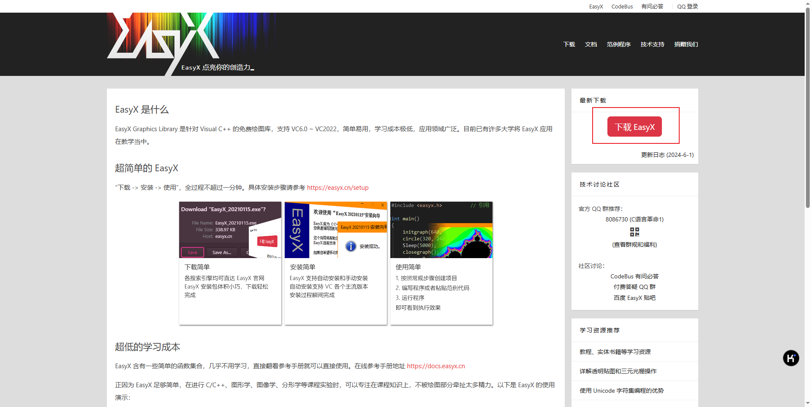
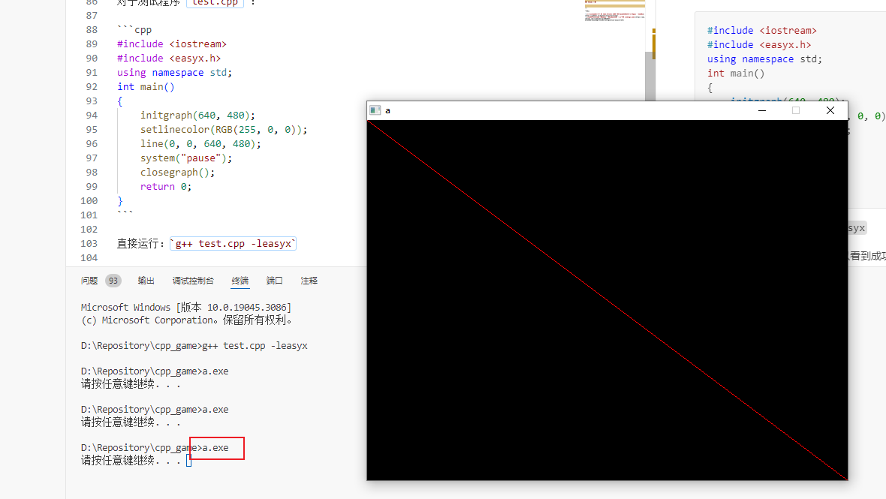

# VSCode 中 Cpp+EasyX 环境的配置

## 0. 引入

### EasyX 介绍

参见 [EasyX 文档 - 基本说明](https://docs.easyx.cn/zh-cn/intro) 。

### 前置环境

1. VSCode
2. C++编译器（以 MinGW-w64 为例）

## 1. EasyX 下载

直接从 [EasyX 官网](https://easyx.cn/) 下载安装程序



下载得到的是一个 `.exe` 文件，根据 [EasyX 文档 - 安装](https://docs.easyx.cn/zh-cn/setup) 的手动安装方法所述，将 `.exe` 文件后缀直接改为 `.7z`，即可解压得到安装包的原始文件。文件结构如：

```
EasyX 安装程序
	├ include <folder>
	│	├ easyx.h 					// 头文件(提供了当前最新版本的接口)
	│	└ graphics.h				// 头文件(在 easyx.h 的基础上，保留了若干旧接口)
	├ lib <folder>
	│	├ VC6 <folder>
	│	│	└ x86 <folder>
	│	│		├ EasyXa.lib		// VC6 库文件(MBCS 版本)
	│	│		└ EasyXw.lib		// VC6 库文件(Unicode 版本)
	│	├ VC2008 <folder>
	│	│	├ x64 <folder>
	│	│	│	├ EasyXa.lib		// VC2008 ~ 2013 库文件(x64, MBCS 版本)
	│	│	│	└ EasyXw.lib		// VC2008 ~ 2013 库文件(x64, Unicode 版本)
	│	│	└ x86 <folder>
	│	│		├ EasyXa.lib		// VC2008 ~ 2013 库文件(x86, MBCS 版本)
	│	│		└ EasyXw.lib		// VC2008 ~ 2013 库文件(x86, Unicode 版本)
	│	└ VC2015 <folder>
	│		├ x64 <folder>
	│		│	├ EasyXa.lib		// VC2015 ~ 2022 库文件(x64, MBCS 版本)
	│		│	└ EasyXw.lib		// VC2015 ~ 2022 库文件(x64, Unicode 版本)
	│		└ x86 <folder>
	│			├ EasyXa.lib		// VC2015 ~ 2022 库文件(x86, MBCS 版本)
	│			└ EasyXw.lib		// VC2015 ~ 2022 库文件(x86, Unicode 版本)
	└ Setup.hta						// 安装程序
```

## 2. 环境配置

根据 [在 CLion、Dev-C++ 或 Code::Blocks 下面配置 EasyX（2024-6-1 更新） - CodeBus](https://codebus.cn/bestans/easyx-for-mingw)

> 基本上，任何开发环境配置 easyx for mingw 都只需两步：
>
> 1. 安装库文件
>
>     下载的压缩包先解压缩，然后将 include 下的头文件和 lib32/lib64 下的库文件，分别拷贝到 MinGW 的头文件和库文件中。如果不确定具体的库文件路径，参考本文末尾的 QA 部分。
>
> 2. 增加编译时的链接选项
>
>     链接选项增加：-leasyx，这样可以在编译的时候链接 libeasyx.a 库文件。每个项目都要这样设置一次，然后编译即可。

直接在 VSCode 中通过 Ctrl+点击 查看头文件目录：`...\mingw64\lib\gcc\x86_64-w64-mingw32\8.1.0\include\c++`。将 EasyX 安装包中 include 文件夹下的两个头文件复制到该目录下。

在 [在 CLion、Dev-C++ 或 Code::Blocks 下面配置 EasyX（2024-6-1 更新） - CodeBus](https://codebus.cn/bestans/easyx-for-mingw) 网页下载得到 EasyX4mingw 安装包（其实可以直接下载这个，这里面的头文件和上面解压得到的头文件完全一样），其内容如下：

```
easyx4mingw_xxxxxxxx.zip
	├ include <folder>
	│	├ easyx.h 				// 头文件(提供了当前最新版本的接口)
	│	└ graphics.h			// 头文件(在 easyx.h 的基础上，保留了若干旧接口)
	├ lib32 <folder>
	│	└ libeasyx.a			// 针对 TDM-GCC 4.8.1 及以上版本的 32 位库文件
	├ lib64 <folder>
	│	└ libeasyx.a			// 针对 TDM-GCC 4.8.1 及以上版本的 64 位库文件
	└ lib-for-devcpp_5.4.0
		└ libeasyx.a			// 适用于 DevCpp 5.4.0 GCC MinGW 4.7.2 和 C-Free 5.0
```

将其中 `lib64` 文件夹下的 `libeasyx.a` 文件复制到 `...\mingw64\lib` 下。

## 3. 编译运行

### 直接编译运行

对于测试程序 `test.cpp` ：

```cpp
#include <iostream>
#include <easyx.h>
using namespace std;
int main()
{
    initgraph(640, 480);
    setlinecolor(RGB(255, 0, 0));
    line(0, 0, 640, 480);
    system("pause");
    closegraph();
    return 0;
}
```

直接运行：`g++ test.cpp -leasyx`

得到 a.exe 文件，运行该文件可以看到成功：



### VSCode 配置

在 `tasks.json` 文件 参数属性 中添加 `-leasyx`：

```json
{
    "tasks": [
        {
            "type": "cppbuild",
            "label": "C/C++: g++.exe 生成活动文件",
            "command": "...\\mingw64\\bin\\g++.exe",
            "args": [
                "-fdiagnostics-color=always",
                "-g",
                "${file}",
                "-o",
                "${fileDirname}\\${fileBasenameNoExtension}.exe",
                "-leasyx"
            ],
            "options": {
                "cwd": "${fileDirname}"
            },
            "problemMatcher": [
                "$gcc"
            ],
            "group": {
                "kind": "build",
                "isDefault": true
            },
            "detail": "调试器生成的任务。"
        }
    ],
    "version": "2.0.0"
}
```

---

参考：

- [在 CLion、Dev-C++ 或 Code::Blocks 下面配置 EasyX（2024-6-1 更新） - CodeBus](https://codebus.cn/bestans/easyx-for-mingw)
- [扩展知识：vscode配置easyx - 秋天的黑太阳 - 博客园 (cnblogs.com)](https://www.cnblogs.com/riskmoumou/p/18023837/extended-knowledge-vscode-configuration-easyx-brbl9)
